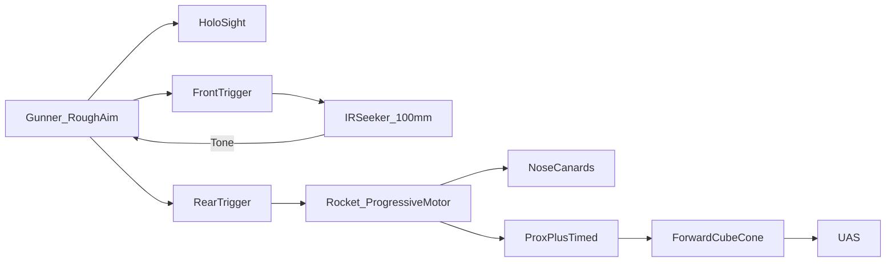

# Annex C — Trades Matrix

**Document ID:** RADR / ANX-C  
**Version:** 0.7.0  
**Status:** Conceptual

See [05 — Key Design Trades](../docs/05-key-design-trades.md).

---

## Selected Trades

| Trade | Rejected | **Selected** |
|-------|----------|--------------|
| Philosophy | Performance-at-any-cost | **KISS / squad-SOF** |
| Payload | HE rod, omnidirectional frag | **Ti/steel cube forward cone** |
| Guidance | Beam-riding, launcher track, high OBA | **Onboard IR F&F + nose canards** |
| Fuze | Seeker-only, single-point timed | **Proximity + timed backup** |
| Motor | Boost-first neutral burn | **Progressive (low 1–2 s, ramp)** |
| Launcher | Disposable | **36 in reusable Gustav breech** |
| Round pack | Bare rocket | **Ravioli-can + pull cap** |
| Sights | Iron only | **Holographic square (+ thermal study)** |

---

## Architecture

---

## Program Exclusions (Historical)

The following were explored in early concept phases and **removed**:

- Laser beam-riding  
- Launcher-tracked guidance  
- Kinetic penetrator rod  
- FMCW radar seeker  
- High off-boresight autopilot  

---

[← 06 — System Description](../docs/06-system-description.md)
