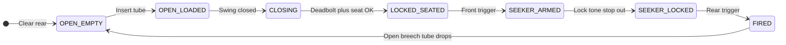
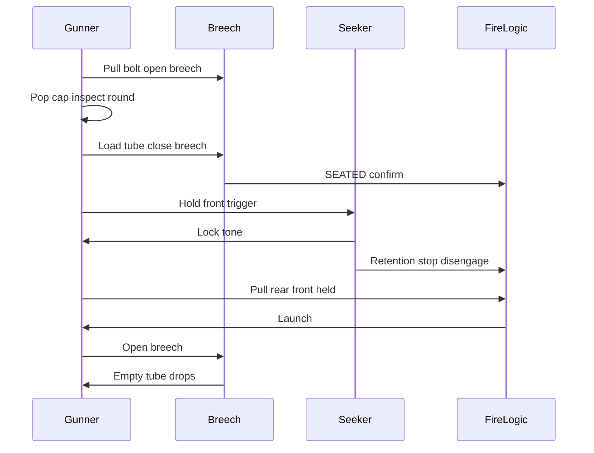

# Annex F — Employment Sequence and Breech Mechanism

**Document ID:** RADR / ANX-F  
**Version:** 1.0.0  
**Status:** Conceptual — locked baseline

Traceability: [06 — System Description](../docs/06-system-description.md) · [04 — CONOPS](../docs/04-conops-use-cases.md)

---

## Loading and Firing Sequence (Locked)

This annex is the **authoritative** employment sequence for RADR. Summary flows in README and DOC-06 defer here for interlocks, states, and abort rules.

### Phase Overview

| Phase | Gunner action | System state | Interlocks |
|-------|---------------|--------------|------------|
| **CLEAR** | Open breech; ensure prior tube ejected | `BREECH_OPEN`, unfired | Rear trigger **disabled** |
| **PREP** | Pull off ravioli-can cap; visual check of seeker dome | Round exposed, **out of bore** | — |
| **LOAD** | Insert protective tube into bore; swing breech closed | `BREECH_CLOSING` | — |
| **SEAT** | Breech deadbolt locks; wait for seat confirm | `LOCKED_SEATED` | Seeker **off** until seated |
| **ARM** | Hold front trigger; rough aim; wait for lock tone | `SEEKER_LOCKED` | Rear trigger **blocked** until tone; retention stop **disengages** with tone |
| **FIRE** | Pull rear trigger while **holding front** | Launch / motor ignition | Front must remain held through ignition; stop stays disengaged while front held |
| **POST** | Open breech after safe interval; tube drops | `BREECH_OPEN_EMPTY` | Clear **10 yd (30 ft)** rear before re-open |

### Step-by-Step Detail

| Step | Action | Expected feedback | Do not |
|------|--------|-------------------|--------|
| 1 | Pull spring bolt handle; swing breech ~90° open | Breech holds open | Stand in backblast cone |
| 2 | Verify bore clear; eject spent tube if present | Empty bore | Load with cap on |
| 3 | Pull-off cap from ravioli-can | Dome and cube pack visible | Force cap; damage dome |
| 4 | Slide tube into bore until fully home | Light detent feel | Slam tube; skip alignment |
| 5 | Swing breech closed; release bolt handle | **Deadbolt snap** — positive lock | Close without full insert |
| 6 | Wait for seat confirm (pressure + contacts) | Seat indicator / logic OK | Arm seeker if not seated |
| 7 | Hold **front trigger**; point roughly at threat | Seeker cooling; search; retention stop **still engaged** until tone | Fire rear without tone |
| 8 | Maintain aim until **audible lock tone** | Steady tone = lock; retention stop **disengages** | Snap-shot off-boresight |
| 9 | While holding front, pull **rear trigger** | Launch + backblast | Release front during ignition (stop re-engages) |
| 10 | Keep position until motor clears tube | Recoilless vent rear | Re-open breech immediately |
| 11 | Open breech; let empty tube fall | Tube drops free | Reach into bore without clear rear |

### Interlocks (Logic Baseline)

| Condition | Front trigger | Rear trigger | Seeker | Retention stop |
|-----------|---------------|--------------|--------|----------------|
| Breech open | Disabled | Disabled | Off | **Engaged** |
| Breech closed, not seated | Disabled | Disabled | Off | **Engaged** |
| Seated, front not held | Enabled (seeker) | **Blocked** | Standby | **Engaged** |
| Seated, front held, no lock | Seeker active | **Blocked** | Acquiring | **Engaged** |
| Seated, front held, lock tone | Held | **Enabled** | Locked | **Disengaged** |
| Front released (any time) | — | **Blocked** | Off / standby | **Re-engages** |
| After fire | Disabled until CLEAR | Disabled | Off | **Engaged** |

### Rocket Retention Stop (Mechanical)

**Purpose:** Prevent the loaded rocket (in protective tube) from sliding **forward** in the bore during **sling carry**, movement, or bump — a **carry-safe** default independent of electronics.

**Mechanism (conceptual):** A spring-biased **bore stop** (finger, cam, or collet segment) bears on the tube rim or rocket shoulder until deliberately released.

**Release logic (all required):**

1. Breech **fully closed** and deadbolt **locked** (`LOCKED_SEATED`).  
2. Gunner **holding front trigger**.  
3. Seeker reporting **ready** (audible lock tone).

**Re-engage:** Any **release of front trigger** — stop returns before rear trigger can matter.

**Note:** Opening breech mechanically clears the bore path; stop state resets to engaged when breech opens.

### Abort and Safety Rules

- **No rear trigger** without lock tone — ever.  
- **No seeker activation** until seating confirmed.  
- **Retention stop engaged** unless breech closed + front held + ready tone.  
- **Rough aim** required — weapon is not high off-boresight.  
- **10 yards (30 ft)** minimum cleared zone to rear before every shot and before breech re-open after fire.  
- If lock tone fails: release front trigger (stop re-engages), re-aim or change position; do not override with rear trigger.

### Notional Timing (Trained Gunner)

| Milestone | Target (notional) | KPP reference |
|-----------|-------------------|---------------|
| Tube in bore → seated | ≤ 10 s | Reload discipline |
| Seated → lock tone | ≤ 15 s | Time to first shot (objective) |
| Lock tone → fire | ≤ 3 s | Gunner decision |
| Fire → breech open for reload | ≤ 15 s | Post-shot SOP |

*Timing is conceptual — not validated in trials.*

---

## Breech Mechanism (Locked Baseline)

Gustav **heritage** flip breech with RADR-specific **spring bolt** and **positive deadbolt** lock. Conceptual description only — not production CAD.

### Components

| Component | Function |
|-----------|----------|
| **Flip breech block** | Closes bore; carries sealing face and rim contacts |
| **Hinge axis** | Rear-mounted pivot; ~90° swing for load |
| **Spring-return bolt handle** | Gunner pulls against spring to unlock; returns when released |
| **Deadbolt detent / cam** | Positive mechanical lock when breech fully closed — “bolt-action feel” |
| **Bore sealing face** | Contains propulsion gases on launch; interfaces with tube rim |
| **Rim electrical contacts** | Seeker power and signal when tube seated |
| **Pressure transducer port** | Confirms tube seated / bore pressurized on closure |
| **Recoilless vent path** | Directs blast rearward per 10 yd danger zone |
| **Rocket retention stop** | Bore finger/cam; spring-default engaged |

### Breech State Machine

| State | Description | Transitions |
|-------|-------------|-------------|
| `OPEN_EMPTY` | Breech open; no round or spent tube ejected | → `OPEN_LOADED` on insert |
| `OPEN_LOADED` | Tube in bore; breech still open | → `CLOSING` on swing shut |
| `CLOSING` | Breech swinging; bolt not yet locked | → `LOCKED_SEATED` on deadbolt + sensors |
| `LOCKED_SEATED` | Ready for seeker; rear blocked | → `SEEKER_ARMED` on front trigger |
| `SEEKER_ARMED` | Seeker on; awaiting lock tone; stop engaged | → `SEEKER_LOCKED` on tone |
| `SEEKER_LOCKED` | Lock tone; retention stop disengaged | → `FIRED` on valid rear pull |
| `FIRED` | Post-launch; venting | → `OPEN_EMPTY` after safe open |

### Operator Mechanical Sequence

1. **Unlock:** Pull bolt handle (compresses return spring).  
2. **Open:** Swing breech block ~90° on hinge — bore exposed.  
3. **Load:** Insert ravioli-can tube (cap already removed).  
4. **Close:** Swing breech to closed position — sealing face mates tube rim.  
5. **Lock:** Release bolt handle; deadbolt cam engages — **audible/mechanical positive stop**.  
6. **Confirm:** Pressure + electrical contacts assert `SEATED`.  
7. **Arm / fire:** Per loading sequence above.

### Heritage Note (Carl-Gustaf M4)

RADR adopts the **familiar flip-breech reload** of the Carl-Gustaf line: open rear, insert round container, close, fire. RADR differs by using a **sealed ravioli-can tube** (not a bare round), a **deadbolt positive lock** for seating certainty, and **electrical rim contacts** for seeker power — optimized for a **guided flak rocket**, not multi-role HEAT.

---

## Employment Sequence Diagram

---

## Related Documents

- [06 — System Description](../docs/06-system-description.md) — Diagrams and summaries  
- [G — Mass and CG](G-mass-and-center-of-gravity.md)  
- [D — Stabilization](D-projectile-stabilization.md)
