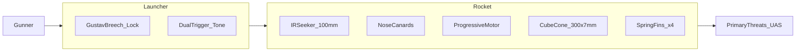
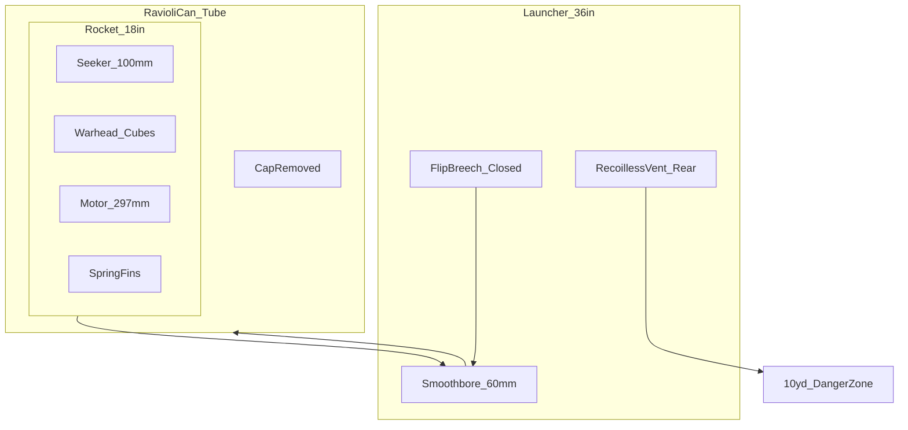
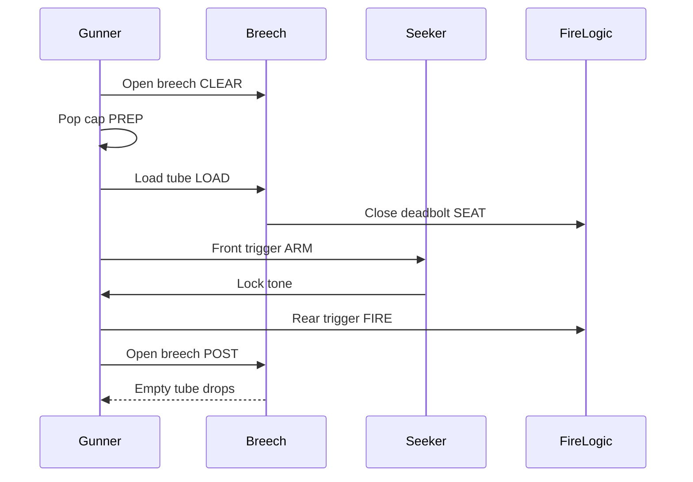

# 06 — System Description

**Document ID:** RADR / DOC-06  
**Version:** 0.9.0  
**Status:** Conceptual

Engineering detail: [Annex F](../annexes/F-employment-and-breech.md) · [Annex G](../annexes/G-mass-and-center-of-gravity.md) · [Annex H](../annexes/H-motor-progressive-burn.md)

---

## System Overview

**RADR** comprises:

1. **Launcher** — 36 in reusable recoilless tube (≤ 5.5 kg empty), Gustav flip breech with spring bolt and positive lock, dual-trigger grips.  
2. **Rocket** — 60 mm × 18 in round (≤ 3.5 kg) in ravioli-can protective tube: IR seeker, progressive motor, dense alloy cube flak warhead.

---

## Diagrams

### Physical Assembly (Conceptual)

How the protective tube, rocket, and launcher relate at **LOCKED_SEATED**:

- **Ravioli-can** is the factory shipping and launch container.  
- **Rocket** rides inside the tube; tube rim mates **breech sealing face** and **rim contacts**.  
- On fire, motor exhaust vents **rear** through launcher — not a closed-bore cannon.

### Employment Sequence (States)

See [Annex F](../annexes/F-employment-and-breech.md) for full interlocks. Summary:

### Post-Fire Tube Ejection

---

## Primary Threats (Design Basis)

| Category | Representative behavior |
|----------|------------------------|
| FPV kamikaze | High closure, terminal dive |
| Small–medium quadcopters | Hover, orbit, light attack |
| Loitering munitions | Commit from standoff |
| GPS-denied / terrain-matching gliders | Low signature glide |
| Group 1–2 swarm / interdiction | Brief exposure, multiple tracks |

---

## Launcher

| Parameter | Spec |
|-----------|------|
| Length | 36 in (914 mm) |
| Mass (empty) | ≤ 5.5 kg (nominal **4.8 kg** — [Annex G](../annexes/G-mass-and-center-of-gravity.md)) |
| Bore | 60 mm smoothbore (baseline) |
| Round | Ravioli-can tube; soldier removes **pull-off cap** before load |
| Seating | Pressure sensor + electrical contacts |
| Triggers | **Front:** seeker + **audible lock tone** · **Rear:** fire (front held) |
| CoG | Slightly **rear-biased** (~248 mm rocket CG — Annex G) |
| Backblast | ≤ **10 yards (30 ft)** rear |
| Tracker | None |

### Breech (Summary)

- **Flip breech block** on rear hinge (~90° open).  
- **Spring-return bolt handle** — pull to unlock, swing breech, release to lock.  
- **Deadbolt cam** — positive mechanical lock when closed.  
- **Rim contacts + pressure port** — assert `SEATED` before seeker.  

Full mechanism and state machine: [Annex F § Breech](../annexes/F-employment-and-breech.md#breech-mechanism-locked-baseline).

---

## Rocket

| Parameter | Spec |
|-----------|------|
| Caliber / length | 60 mm × 18 in (457 mm) max |
| Mass | ≤ 3.5 kg (nominal **3.1 kg** — Annex G) |
| Seeker | 100 mm IR fire-and-forget |
| Canards | Small movable surfaces **near nose** |
| Fins | 4 swept **spring-loaded** at **base**; deploy on exit |
| Motor | Progressive burn — [Annex H](../annexes/H-motor-progressive-burn.md) |
| Warhead | 300 × 7 mm **dense alloy** rough-edged cubes |
| Dispersal | Forward cone ~10–12 ft wide @ ~20 ft |
| Fuze | **Proximity primary** + **timed backup** |

### Mass (Summary)

| Component | kg (nominal) |
|-----------|--------------|
| Seeker + avionics | 0.65 |
| Warhead | 1.05 |
| Motor + propellant | 1.20 |
| Structure, fins, canards | 0.20 |
| **Total** | **3.10** |

Detail and CG: [Annex G](../annexes/G-mass-and-center-of-gravity.md).

---

## Motor (Summary — 1000 m Goal)

| Time (s) | Thrust (N, notional) | Phase |
|----------|----------------------|--------|
| 0–2.0 | ~700 avg | Low — recoil/backblast |
| 2.0–3.2 | 750 → 1050 ramp | Progressive |
| 3.2–3.4 | ~950 tail | Burnout |

**Total impulse:** ~2900 N·s (band 2800–3200 N·s). Full table: [Annex H](../annexes/H-motor-progressive-burn.md).

---

## Fuze and Kill Chain

1. Proximity initiates at **~20 ft** (primary).  
2. Timed backup if proximity fails.  
3. Burster opens cube pack into **forward cone**.  
4. Cubes strike rotors, battery, sensors, and airframe.

---

## Operational Flow (Summary)

| Step | Action |
|------|--------|
| 1 | Open breech |
| 2 | Pop cap off tube |
| 3 | Load tube |
| 4 | Close breech — deadbolt locks, **SEATED** |
| 5 | Hold front trigger → **lock tone** |
| 6 | Pull rear trigger (front held) → fire |
| 7 | Open breech → empty tube drops out |

**Authoritative detail** (interlocks, abort rules, timing): [Annex F](../annexes/F-employment-and-breech.md).

---

## Employment

**Team:** Gunner + ammo bearer. **Single carry:** ≤ 9.0 kg (nominal **7.9 kg** loaded — Annex G).

---

[← Key Design Trades](05-key-design-trades.md) | [Next: Limitations →](07-limitations-and-risks.md)
