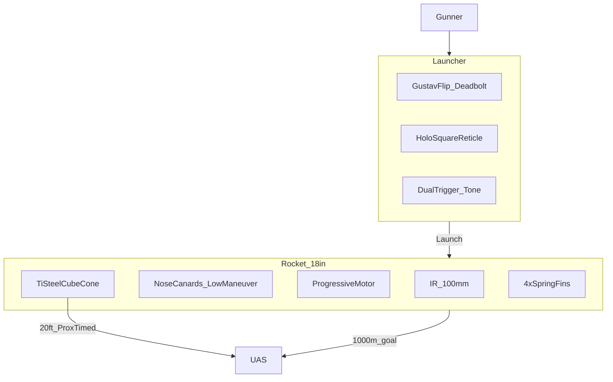

# 06 — System Description

**Document ID:** RADR / DOC-06  
**Version:** 0.7.0  
**Status:** Conceptual — refined baseline

---

## System Overview

1. **Launcher** — 36 in reusable recoilless tube, ≤ 5.5 kg empty, Gustav flip breech with spring bolt and deadbolt lock, holographic sight.  
2. **Rocket** — 60 mm × 18 in round in ravioli-can tube, ≤ 3.5 kg, IR seeker + progressive motor + Ti/steel cube flak.

---

## Launcher

| Parameter | Spec |
|-----------|------|
| Length | **36 in (914 mm)** |
| Mass (empty) | **≤ 5.5 kg** |
| Bore | **60 mm** smoothbore (baseline) |
| Breech | **Gustav-style flip**; **spring-loaded bolt**; **positive deadbolt-style lock** (bolt-action feel) |
| Round load | **Ravioli-can** protective tube; soldier **pulls off cap** before insert |
| Seating | Pressure sensor + electrical contacts |
| Triggers | **Front:** seeker power + **audible lock tone** · **Rear:** fire (requires front held) |
| Sights | **Advanced holographic**, **square reticle**; basic **thermal overlay** under evaluation |
| CoG (launcher) | **Slightly rear-biased** for shouldering |
| Backblast | **≤ 10 yards (30 ft)** rear — locked |
| Tracker | **None** — dumb tube |

### Launcher Mass (Notional)

| Component | kg |
|-----------|-----|
| Tube + breech mechanism | 3.2–3.8 |
| Grips, pad, holographic sight | 0.9–1.2 |
| Contacts + sensors | 0.2–0.3 |
| **Total** | ≤ **5.5** |

---

## Rocket — 60 mm × 18 in

Factory-finished round ships in a **robust ravioli-can protective tube** with **pull-off cap**. Tube protects seeker dome and cube pack in storage and transit; acts as launch container until ejected after firing.

### Mass Breakdown (Notional)

| Component | kg | Notes |
|-----------|-----|-------|
| Warhead | 0.95–1.15 | 300 × 7 mm **Ti/steel** rough-edged cubes; small burster |
| Seeker + avionics | 0.45–0.55 | **100 mm** IR F&F |
| Motor + propellant | 1.10–1.30 | Progressive grain |
| Structure, fins, canards | 0.35–0.45 | 4 base fins + nose canards |
| **Total** | ≤ **3.5** | Locked cap |

### Layout (Aft → Front)

| Section | Function |
|---------|----------|
| Motor + nozzle | Progressive burn; speed-to-target |
| Fins (4) | Swept, spring-loaded; deploy on exit |
| Warhead | Cube pack + burster |
| Avionics | Autopilot for canards |
| Canards | Small movable surfaces **near nose** |
| Seeker | **100 mm** IR dome |

**CoG:** **Slightly rear-biased** for stable shoulder carry and launch impulse.

---

## Motor

| Parameter | Spec |
|-----------|------|
| Type | **Progressive burn** solid grain |
| Initial phase | **Lower thrust 1–2 seconds** (recoil/backblast control) |
| Ramp | Increasing thrust for velocity at range |
| Grain length (notional) | ~260 mm |
| Propellant mass | ~1.15–1.25 kg |
| Burn time | ~3.0–3.4 s |
| Range goal | **1000 m** effective (notional trajectory) |

---

## Warhead

| Item | Spec |
|------|------|
| Fragments | **300 × 7 mm** dense **Ti/steel** alloy cubes, **rough-edged** |
| Pattern | **Forward cone** — **~10–12 ft** wide at **~20 ft** standoff |
| Burster | Small; **disperses only** |
| Kill | Multiple high-velocity cube strikes on rotors, battery, sensors, frame |

---

## Fuze

| Layer | Function |
|-------|----------|
| **Proximity (primary)** | Initiate dispersal at **~20 ft** for cone geometry |
| **Timed (backup)** | Failsafe actuation if proximity does not fire |

Architecture is **locked**; sensor selection and timing tolerance are engineering detail.

---

## Guidance & Control

| Item | Spec |
|------|------|
| Seeker | **100 mm** IR; **lock before launch** |
| Indication | **Audible tone** via launcher when locked |
| Flight control | **Small movable canards near nose** |
| Maneuver class | **Low** — trim corrections, not high divert |
| Employment | Gunner **rough-aims** within seeker FOV |

---

## Operational Flow

| Step | Action |
|------|--------|
| 1 | Open breech — pull **spring bolt**, swing open |
| 2 | **Pop top** off ravioli-can tube |
| 3 | Load tube into launcher |
| 4 | Close breech — **auto deadbolt lock** |
| 5 | Hold **front trigger** → seeker on → **tone** at lock |
| 6 | Pull **rear trigger** (front held) → launch |
| 7 | Fins deploy; motor ramps; canards trim |
| 8 | **~20 ft** — proximity (timed backup) → cube cone |
| 9 | Open breech — **empty tube drops** — reload |

---

## Kill Mechanism

Rough-edged **Ti/steel cubes** at high closing velocity — structural and component damage to non-survivable UAS. Not a shaped-charge penetrator.

---

[← Key Design Trades](05-key-design-trades.md) | [Next: Limitations →](07-limitations-and-risks.md)
