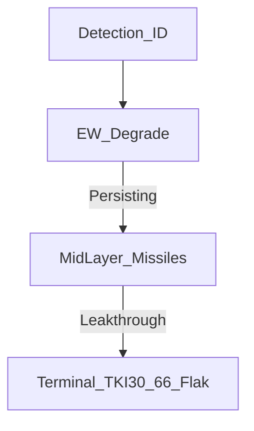

# 08 — Layered Defense Integration

**Document ID:** TKI-30-66 / DOC-08  
**Version:** 0.4.0  
**Status:** Conceptual

---

## Purpose

Placement of TKI-30-66 as a **terminal guided-flak layer** in counter-UAS architecture.

---

## Layered Model

| Layer | TKI-30-66 Role |
|-------|----------------|
| Detect / ID | Receives cues; gunner visually/IR locks |
| EW | EW first; TKI for RF-immune / failed EW |
| Mid-layer | Coyote/Stinger when available |
| **Terminal** | **Close-in flak rocket — primary TKI role** |

---

## Integration

- **Cueing:** Acoustic/optical sensors reduce search time; gunner still must achieve IR lock.
- **EW:** Autonomous/fiber UAS → TKI primary when jamming ineffective.
- **Cost-exchange:** Cheap UAS vs. $120k missile → TKI favorable vs. missiles, costlier than small arms.
- **Obscuration:** Smoke degrades IR seeker — same as other IR systems; no laser deconfliction needed.
- **Signature:** Passive IR homing on rocket; no active laser.

---

## Escalation (Notional)

1. ID hostile UAS  
2. EW if RF-controlled  
3. Mid-layer if range and asset available  
4. **TKI-30-66** for close-in leakthrough  
5. Small arms last resort  

---

## Related Documents

- [07 — Limitations and Risks](07-limitations-and-risks.md)
- [Annex A — Baseline Comparison](../annexes/A-baseline-comparison.md)

---

[← Limitations and Risks](07-limitations-and-risks.md) | [README →](../README.md)
